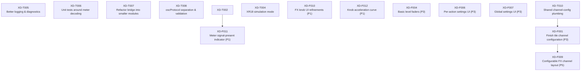

Prefixes: XD-F = feature, XD-B = bug, XD-T = tech/cleanup P4= I don't know why we need this, but Chappie seems interested. P1-3= My rankings P5=Probably gonna kill this one

## 1. Active board (for current revsion)

| ID      | Title                                           | Pr | Type | Notes |
|---------|-------------------------------------------------|----|------|-------|
| XD-F011 | Signal-present indicator                        | P1 | feat | Depends on T002 |
| XD-F010 | FX knob UI refinements                          | P1 | feat | Independent |

## 2. Feature backlog

| ID      | Title                                           | Pr | Depends | Notes |
|---------|-------------------------------------------------|----|---------|-------|
| XD-F011 | Meter signal-present indicator                  | P1 | XD-T002 | Add a minimal “signal present” cue at the very bottom of the dotmeter so activity is visible even with a raised floor / hidden low range (e.g. a baseline pixel/LED that lights whenever recent signal exceeds the noise floor). |
| XD-F010 | FX knob UI refinements                          | P1 |         | Refine layout for clarity of numeric value and longer channel name. we can definiely fit another line or so. |
| XD-F013 | FX bus-assignment UI                            | P1 |         | Tap FX tile enters Assign Mode (bus A selected); taps cycle A→B→C→EXIT; knob press toggles selected bus assignment and exits; timeout auto-exits with no change. Phase 1 uses text-only bus indicators in the title; graphical 3-pip strip can follow once SVG-based rendering is available. |
| XD-F012 | Knob accelleration curve                        | P1 |         | Universal scaling math for smooth accelleration; fine control slow, zippy control fast|
| XD-F004 | Basic level faders for key inputs               | P3 |         | A page where encoders act as faders for mapped channels and buttons reflect ch info and bank switching or sends. |
| XD-F006 | Per-action settings UI                          | P3 |         | For each action: source selector (Ch 1–18, Bus, FX), label override, meter mode (normal/raised-floor/peaks). |
| XD-F007 | Global settings UI                              | P3 |         | Bridge host/port, meter update rate,skin, meter style, type size if accessible |
| XD-F001 | Finish tile channel configuration               | P3 | XD-T010 | User-facing feature: tiles (Channel, FX, future types) can target any XR18 source with persistent mapping; uses shared config plumbing (XD-T010). |
| XD-F009 | Configurable channel layout for FX type         | P5 | XD-F001 | Simple JSON or similar mapping so layout isn’t hard-coded (e.g. which XR18 source each tile represents). If fixed layouts are fine, you can skip this|

## 3. Bugs / regressions

Capture what you expected, what actually happened, and how to reproduce.

| ID      | Title                                           | Pr | Depends | Notes |
|---------|-------------------------------------------------|----|---------|-------|
| XD-B001 | (none logged yet)                               | P3 |         | Placeholder row; replace with the first real bug you encounter. |

## 4. Technical / cleanup tasks

| ID      | Title                                           | Pr | ? | Depends | Notes |
|---------|-------------------------------------------------|----|---|---------|-------|
| XD-T005 | Better logging and diagnostics                  | P2 |   |         | Structured logs for OSC and WebSocket traffic + connection state, with configurable log levels. |
| XD-T006 | Unit tests around meter decoding                | P2 |   |         | Sample `/meters/1` blobs mapped to expected per-channel levels to guard against regressions. |
| XD-T007 | Refactor bridge into smaller modules            | P2 |   |         | Split bridge into OSC transport, WebSocket transport, protocol/schema, and app entrypoint modules. |
| XD-T008 | `oscProtocol` separation and validation         | P2 |   |         | Centralize XR18 OSC message construction/parsing in an `oscProtocol` module and align with `wsProtocol` schemas; single validation point instead of ad-hoc shapes. |
| XD-T010 | Shared channel-config plumbing for all tiles    | P2 |   |         | Extract Channel Button mapping logic into a shared config module used by all tile types (Channel, FX, future fader pages). Supports XD-F001. |
| XD-T011 | SVG tile rendering engine                       | P2 |   |         | Introduce a small rendering module that outputs per-tile SVG images (meters, pip strips, safe-state indicators) and sends them via setImage. Enables graphical bus pips for XD-F013 Phase 2 and future unified visual layouts. |
| XD-T020 | Switch to bridge-less architecture (rev 2.0)    | P0 |   |         | Investigate collapsing SwiftBar bridge into Stream Dock plugin backend for public release. Goal: single install, no helper apps. Review SDK lifecycle, UDP/OSC feasibility, internal modularization, and distribution implications. See discussion re: internal backend vs external bridge. |
| XD-T004 | XR18 simulation mode                            | P5 |   |         | Optional mode where the bridge simulates `/meters/1` and basic channel state for development without the mixer. Only useful if you want to develop the plugin without the mixer turned on.| 

## 5. Done (for future changelog)

- 2025-12-13 – XD-T009: Globalized safe-state handling end-to-end (bridge + protocol + plugin). Formal LIVE / STALE / OFFLINE model derived from OSC receive activity + meter-frame heartbeats (WebSocket lifecycle is used for propagation only); control writes gated unless LIVE; OFFLINE/STALE UI freezes meters and blocks local “ghost” moves; clean recovery on bridge restart.
- 2025-12-13 – XD-T002: Hardened `/meters/1` decoding path. Isolated blob decode into non-throwing helper; centralized meter conversion math; bounds-safe mapping; prevents malformed meter frames from stalling bridge or locking UI.
- 2025-12-09 – XD-F012: Channel Button on-air indicator graphic (Channel Button tiles now show an on-air green glow and ON/LIVE text when unmuted, OFF SAFE when muted, and OFFLINE when the bridge is down).
- 2025-12-09 – XD-F002: Bridge starts up active (SwiftBar plugin now auto-starts the bridge on login and keeps it running unless explicitly disabled via the menu).
- 2025-12-04 – XD-F003: FX returns control surface (bi-directional control of FX return fader, mute, name, and meters).
- 2025-12-04 – XD-T001: Explicit OSC session lifecycle handling (`/xremote` + `/renew`, reconnect logic, and connection state exposed to plugin).
- 2025-12-04 – XD-F008: Graceful “no bridge” behaviour (tiles indicate offline state instead of failing silently).
- 2025-12-04 – XD-T003: Initial `wsProtocol` module created to isolate WebSocket message schema between bridge and plugin.

## Dependency Graph

